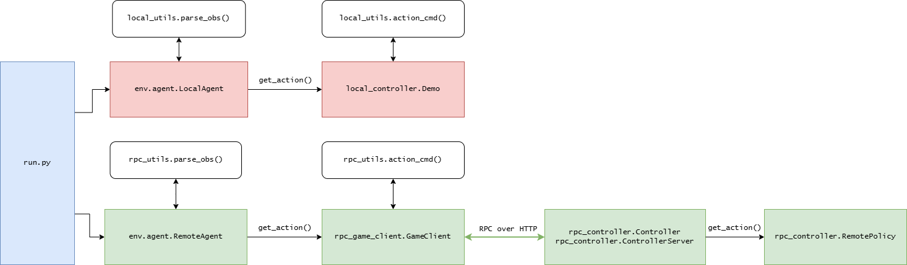

# StarCraft II Challenge 2025
A challenge environment for controlling SC2 units. Based on [PySC2](https://github.com/google-deepmind/pysc2) specifically for exploring heuristic tactics.

## Installation Instructions
1. Install dependencies in a virtual environment `pip install -r requirements.txt`
2. Move challenge maps to `\<StarCraft II Installation Directory\Maps\EEE466\*.SC2Map`
3. Add `Version("5.0.13", 92174,"D44E66924A56B2D4BC94786D8A7EB5B8", None),` to `venv\Lib\site-packages\pysc2\run_configs\lib.py VERSIONS`

## Scenario
Each game of StarCraft II begins with a home base (command center) and a group of workers (SCVs). The base is near mineral fields which the workers can mine minerals from, this serves as currency to build new units and structures. In the game scenario you're objective is to destroy your opponent's pylon - it's a crystal structure. However, your opponent has a combat unit and you do not. To make combat units you need to build a factory (barracks) to train new marines. The steps to a successful policy then are: harvest minerals, build barracks, train marines, and once you have enough marines, destroy their pylon.

## Design
There are two parts to this exercise: 1. make a local policy that enables your team to destroy the opponent's structure, 2. remotely control game actions using a gRPC controller.

### StarCraft II Challenge
The codebase for SC2 challenge is divided into the following modules: `env` contains the classes and functions needed to start and control instances of StarCraft using custom agents. `local_controller` contains a fully implemented policy, "Demo". This policy implements local functions to select actions. It uses data classes defined in `local_utils.py` to handle observations and actions. You are tasked with creating a policy that uses protobuf structures instead of data classes and gRPC instead of local function calls. The diagram below compares how the call to `get_action` differs between the local and remote implementations.



### Actions
Your policy takes the current game state as input and produces an action as its output. Actions in PySC2 are sepecific functions listed in `pysc2.lib.actions`. For the purpose of this exercise, the action space has been constrained to 8 actions, see exercise3.proto ActionType. Each action has parameters, all actions target a friendly unit (which may be a structure) and some have targets (either an x,y coordinate or another unit). The map allows coordinates: x=[0,32], y=[0,32]. However, units can't actually stand on the edge of the map (since the platform drops off) so using the bounds 1-31 is preferred in most cases.
```proto2
enum ActionType {
    // Move a unit to target point
    MOVE = 1;
    // Unit travels back and forth between current position and target point
    PATROL = 2;
    // Unit attacks target point
    ATTACK = 3;  
    // SCV gathers resources from target mineral field
    // Interrupting this action cancels the harvest
    HARVEST = 4;
    // SCV unit builds barracks unit at target point
    // Interrupting this action cancels the build
    BUILD_BARRACKS = 5;
    // Barracks builds marine unit
    TRAIN_MARINE = 6;
    // Unit stops current action
    CANCEL = 7;
    // Continue game without taking an action
    NO_OP = 8;
}

message Action {
    required ActionType action_type = 1;
    required uint64 unit_tag = 2;
    optional Point target_point = 3;
    optional uint64 target_tag = 4;
    optional Timing timing = 5;
}
```

### Units
Units are a data structure representing attributes of a unit (e.g., SCV, marine, barracks), see exercise3.proto Unit.
```proto2
message Unit {
  required uint64 unit_tag = 1;
  required int32 unit_type = 2;
  required int32 player = 3;
  required int32 health = 4;
  required int32 shields = 5;
  required float x = 6;
  required float y = 7;
  required float progress = 8;
}
```

### Observations
Each turn, the game engine provides an observation object and requests that each agent return an action object. An observation contains information about the player's resources and lists of units.
```proto2
message Action {
    required ActionType action_type = 1;
    required uint64 unit_tag = 2;
    optional Point target_point = 3;
    optional uint64 target_tag = 4;
    optional Timing timing = 5;
}
```

### Object translation
The local agent uses a custom dataclass to hold action, unit, and observation data. It uses the functions in `local_utils` to transform these objects into a format that the game engine can understand. Likewise, you've been provided with the protobuf definitions that will allow you to construct a policy. `rpc_utils` has functions that transform the provided protobuf definitions into objects for the game engine. When creating actions, examine `rpc_utils.action_cmd` to understand the required parameters.

### Running the game
Use `run.py` to configure and run games. Within `run.main` you can set a few parameters:
- map_name: exercise3. Other maps are available but not part of this exercise.
- visualize: shows multiple graphics of the game board.
- replay: saves a replay file of the match.
- configs: include 2 player configs. By default a local player is selected. You are evaluated on your REMOVE vs. BOT implementation

The game ends in a win for player 1 if:
- The pylon is destroyed within five minutes of in-game time
The game ends in a loss for player 1 if:
- There are no player 1 SCVs or marines
- The pylon is standing after five minutes of in-game time

## Requirements
### Policy
- `RemotePolicy` must inherit from `rpc_controller.Policy` and override the `get_action` method.
- `RemotePolicy` must use protobuf definitions for observations, units, actions, and their attributes. Other game data (i.e., state information) may be stored in other formats.
- `RemotePolicy` must always win against the bot player by destroying the opponent's pylon before the time limit - by any means necessary.
- `RemotePolicy` cannot import from `rpc_utils.py`. All object translation must occur at the GameClient.

### RPC
- `exercise3.proto` must include at least one rpc method.
- GameClient is the only interface with Controller. This interface must use gRPC.
- Controller creates an instance of `RemotePolicy`. Controller only handles the gRPC service and does not store game information.
- The remote server must be started as a separate process from `run.py`.
